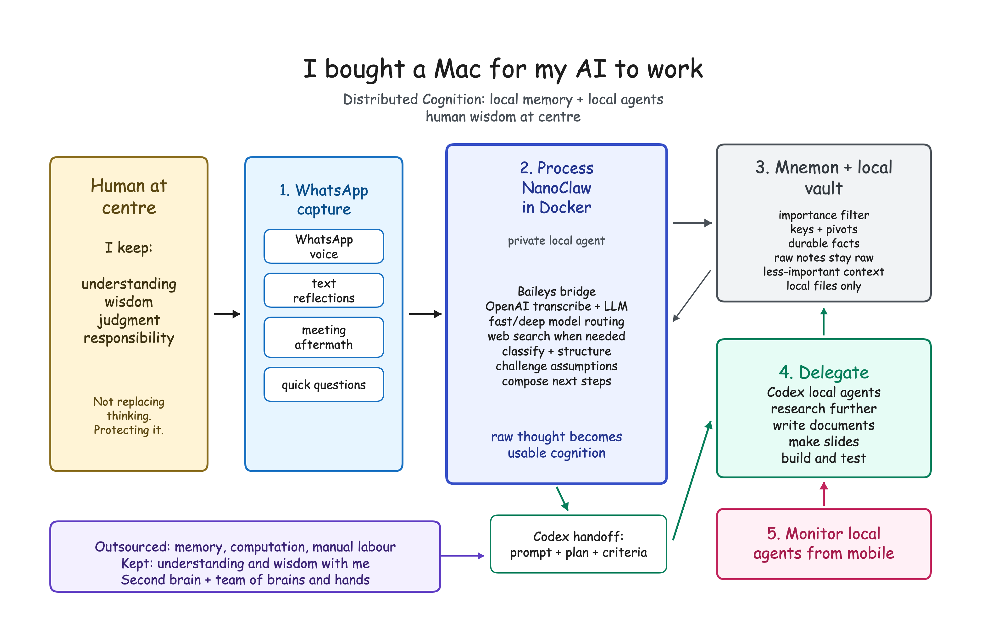

# DistributedCognition

DistributedCognition is a local-first, WhatsApp-based reflective capture and project-memory assistant built on [NanoClaw](https://github.com/nanocoai/nanoclaw).

It is designed as a second mind for capturing voice notes, reflections, decisions, open questions, and project context, then turning the high-signal parts into structured Markdown, curated Mnemon memory, and local Codex handoffs. The default architecture keeps storage on the local computer, mounts only explicitly selected folders into Docker, and routes larger work to local agents rather than giving the WhatsApp-facing assistant broad host access.



Key additions in this fork:

- WhatsApp/Baileys private-mode allowlist and safe outbound sending.
- OpenAI/Codex provider path with lightweight model routing.
- Distributed Cognition note capture, audio transcription, context indexing, Mnemon promotion, project wiki promotion, deadline-watch tools, and an Obsidian-friendly dashboard.
- Host-side Codex/action bridges for local project work, web research, Word documents, and PowerPoint generation.
- Hermes-inspired capability routing, unified work queue status, append-only provenance, capture and delivery ledgers, attention calibration, memory hygiene, project ontology, bridge progress events, and a Mnemon memory report.
- Optional launchd jobs for periodically running the local bridges on macOS.
- Public-web search/read tools with private-network and sensitive-content guards.
- Lightweight retrieval eval reports for checking what the Dropbox-backed context index can and should surface.
- Documentation for local Dropbox-style mounts and future Raspberry Pi deployment.

Useful Distributed Cognition docs:

- [Setup and safety model](docs/distributed-cognition.md)
- [Raspberry Pi migration runbook](docs/raspberry-pi-migration.md)
- [Synthetic flow demo](docs/distributed-cognition-flow-demo.md)
- [Retrieval eval checklist](docs/distributed-cognition-retrieval-evals.md)
- [Public LinkedIn post draft](docs/linkedin-distributed-cognition-post.md)

## Distributed Cognition Commissioning

The intended live loop is:

```text
private WhatsApp text or voice note
  -> raw Markdown capture
  -> processed reflection / decision / note
  -> provenance + capture/delivery ledgers + attention scoring + coaching prompt
  -> selective Mnemon durable-memory upgrade
  -> project ontology, wiki, deadline, and open-question updates
  -> optional local Codex handoff
  -> Codex desktop/app-visible local work
```

For host-side setup after configuring the selected second-brain folder:

```bash
pnpm run dc:ensure-docker-access -- --second-brain-root "<local Distributed-Cognition folder>"
pnpm run dc:health -- --root "<local Distributed-Cognition folder>"
pnpm run dc:dashboard -- --root "<local Distributed-Cognition folder>"
pnpm run dc:retrieval-eval -- --root "<local Distributed-Cognition folder>"
pnpm run dc:memory-report -- --root "<local Distributed-Cognition folder>"
pnpm run dc:install-launchd -- install --root "<local Distributed-Cognition folder>"
pnpm run dc:memory-bridge -- process
pnpm run dc:memory-bridge -- process --execute
pnpm run dc:codex-bridge -- process
pnpm run dc:codex-bridge -- process --execute
pnpm run dc:action-bridge -- process
pnpm run dc:action-bridge -- process --execute
```

The bridge commands run on the host where you invoke them, not inside the WhatsApp container. The container may queue work, but Mnemon promotion, local Codex execution, and artifact generation remain controlled by host-side allowlists and bridge config. Before Pi migration this is usually the Mac. After Pi migration, run the DC/WhatsApp runtime on the Pi; use Pi-side bridge timers for always-on maintenance, or run the Mac bridge jobs only when you deliberately want Codex Desktop/App-visible local handoffs. When the Pi operator environment is sourced, new Codex/action bridge configs include Raspberry Pi SSH context so Mac Codex threads know they are controlling the Pi rather than restarting the Mac host.

For always-on Mac use, install user-level launchd jobs after the manual commands work:

```bash
pnpm run dc:install-launchd -- install \
  --root "<local Distributed-Cognition folder>" \
  --projects-root "$HOME/Documents/Codex" \
  --execute-bridges \
  --load
pnpm run dc:install-launchd -- status
```

Omit `--execute-bridges` for a dry-run scheduler. Logs are written under `logs/launchd/`, and `pnpm run dc:install-launchd -- uninstall` removes the generated LaunchAgents.

For Raspberry Pi cutover, use Codex on the Mac as the SSH control plane, but run Distributed Cognition fully on the Pi. Stop the Mac launchd jobs before exporting state, restore the state bundle on the Pi, sync only the selected `Distributed-Cognition` folder with external rclone, and run NanoClaw as a Pi systemd service. The final export writes a local Mac runtime lock so this checkout will not restart WhatsApp/Baileys by accident after the Pi takes over. See [docs/raspberry-pi-migration.md](docs/raspberry-pi-migration.md).

To print a read-only cutover checklist from your current environment:

```bash
pnpm run pi:cutover-plan -- \
  --local-root "<local Distributed-Cognition folder>" \
  --pi-host "<pi-host-or-ip>" \
  --pi-user "<pi-ssh-user>" \
  --pi-path "<pi NanoClaw checkout path>" \
  --pi-second-brain-root "<pi Distributed-Cognition path>" \
  --pi-codex-projects-root "<pi Codex projects path>" \
  --repo-url "<DistributedCognition repo URL>"
```

To let Codex on the Mac prepare a fresh Pi over SSH, run the bootstrap helper
in dry-run mode first:

```bash
pnpm run pi:ssh-bootstrap -- \
  --host "<pi-host-or-ip>" \
  --user "<pi-ssh-user>" \
  --path "<pi NanoClaw checkout path>" \
  --second-brain-root "<pi Distributed-Cognition path>" \
  --codex-projects-root "<pi Codex projects path>" \
  --repo-url "https://github.com/chowminyang/DistributedCognition.git"
```

When the dry-run output looks right, add `--execute`. This installs basic
packages, clones/builds the repo, creates the selected local folders, and
checks Docker, but it does not copy secrets, import WhatsApp auth, start
NanoClaw, configure rclone, or install the systemd service.

After the final Mac export, restore the secret state bundle from the Mac
control plane with a dry run first:

```bash
STATE_BUNDLE="$(ls -t "$HOME/Desktop/dc-pi-migration"/nanoclaw-pi-state-*.tar.gz | head -n 1)"

pnpm run pi:inspect-state-bundle -- --bundle "$STATE_BUNDLE"

pnpm run pi:ssh-restore-state -- \
  --host "<pi-host-or-ip>" \
  --user "<pi-ssh-user>" \
  --path "<pi NanoClaw checkout path>" \
  --bundle "$STATE_BUNDLE" \
  --force \
  --cleanup-remote
```

When the dry-run output is correct and the Mac host is stopped, add
`--execute`. The execute path refuses while this Mac checkout appears to be
running a NanoClaw host or Docker agent container unless
`--allow-mac-host-running` is used for explicit rollback or emergency work. The
helper inspects the local bundle first, copies the bundle and checksum to the
Pi, verifies the checksum on the Pi, imports state with the existing safe
importer, and rebuilds. The importer also refuses to run while a NanoClaw host
process or Docker agent container appears to be active on the Pi, unless
`--allow-running` is explicitly used for emergency recovery. It does not start
NanoClaw, configure rclone, or install systemd.

Then start the Pi runtime setup with another dry run:

```bash
pnpm run pi:ssh-start-runtime -- \
  --host "<pi-host-or-ip>" \
  --user "<pi-ssh-user>" \
  --path "<pi NanoClaw checkout path>" \
  --second-brain-root "<pi Distributed-Cognition path>" \
  --codex-projects-root "<pi Codex projects path>" \
  --rclone-remote dropbox:
```

When the dry-run output is correct, add `--execute`. The execute path refuses
to start the Pi runtime if this Mac checkout still appears to be running
NanoClaw or has running NanoClaw Docker agent containers, unless you explicitly
pass `--allow-mac-host-running` for rollback or emergency work. It
installs/starts the rclone timer for only the selected
`Distributed-Cognition` folder, updates the Docker mount allowlist and group
mounts, installs/starts the Pi systemd service, installs/starts Pi bridge
timers for health, dashboard, Mnemon, Codex, and action queues, and runs
`dc:health`. Bridge timers are dry-run by default. For the recommended Pi
cutover mode, pass `--bridge-execute-mode memory` so Mnemon durable-memory
promotion runs automatically on the Pi while Codex/action handoffs remain
reviewable from Mac Codex. Use `--execute-bridges` only when you intentionally
want memory, Codex, and action queues to execute automatically on the Pi.

To generate a paste-ready `/goal` prompt for the Mac Codex thread that will
control the Pi on migration day:

```bash
pnpm run pi:codex-goal -- \
  --local-root "<local Distributed-Cognition folder>" \
  --pi-host "<pi-host-or-ip>" \
  --pi-user "<pi-ssh-user>" \
  --pi-path "<pi NanoClaw checkout path>" \
  --pi-second-brain-root "<pi Distributed-Cognition path>" \
  --pi-codex-projects-root "<pi Codex projects path>"
```

To rehearse the Mac-control-plane handoff in one non-mutating bundle:

```bash
pnpm run pi:rehearse-cutover -- \
  --local-root "<local Distributed-Cognition folder>" \
  --pi-host "<pi-host-or-ip>" \
  --pi-user "<pi-ssh-user>" \
  --pi-path "<pi NanoClaw checkout path>" \
  --pi-second-brain-root "<pi Distributed-Cognition path>" \
  --pi-codex-projects-root "<pi Codex projects path>"
```

This creates `output/pi-cutover-rehearsal/DD-MM-YY-HHMM/` with the Codex
`/goal`, a non-secret `operator-env.sh` file to source in the Mac Codex
thread, cutover checklist, SSH bootstrap dry run, SSH state-restore dry run,
SSH runtime-start dry run, and a summary. It does not open SSH, stop the Mac
host, export state, import state, or touch WhatsApp. The generated operator
environment also sets `NANOCLAW_PI_SSH_CONNECT_TIMEOUT=10` so SSH helpers fail
quickly if the Pi hostname or IP is stale,
`NANOCLAW_PI_BRIDGE_EXECUTE_MODE=memory` so the Pi rehearses Mnemon promotion
without hiding Codex/action handoffs from Mac Codex,
`NANOCLAW_PI_EXPECTED_BRIDGE_EXECUTE_MODE=memory` so post-cutover checks prove
the installed systemd bridge timers match that mode, and
`NANOCLAW_PI_EXPECTED_COMMIT` so Pi status/doctor checks prove the runtime
checkout matches the rehearsed Mac commit. The generated `/goal` also names the
exact `operator-env.sh` path, so the Mac Codex cutover thread can source the
same non-secret values before controlling the Pi over SSH.

To produce a broader Mac-side readiness bundle before Tuesday:

```bash
pnpm run pi:mac-readiness -- \
  --local-root "<local Distributed-Cognition folder>" \
  --pi-host "<pi-host-or-ip>" \
  --pi-user "<pi-ssh-user>" \
  --pi-path "<pi NanoClaw checkout path>" \
  --pi-second-brain-root "<pi Distributed-Cognition path>" \
  --pi-codex-projects-root "<pi Codex projects path>"
```

This gathers git status, public branch commit reachability, public-readiness,
DC health, Mac export preflight, and the Pi rehearsal into
`output/pi-mac-readiness/DD-MM-YY-HHMM/`. It is still
non-mutating: it does not SSH, stop the Mac host, export state, or touch
WhatsApp auth. The readiness output also points to
`rehearsal/operator-env.sh`, a fillable non-secret environment file. If Pi
values are still missing, uncomment and set the missing `NANOCLAW_PI_*` lines
there, source it from the Mac Codex shell, then rerun readiness.

When the Pi is on the network, add `--include-ssh-preflight` to the same
command. That opens SSH only to run `pi:ssh-preflight`; it still does not start
services, copy secrets, export state, or touch WhatsApp auth.

Before pushing a public update, run the local public-boundary and Pi helper checks:

```bash
pnpm run dc:public-readiness
pnpm run pi:test-helpers
```

Before taking the final Mac state bundle:

```bash
pnpm run dc:stop-host
pnpm run pi:mac-preflight -- \
  --root "<local Distributed-Cognition folder>" \
  --out-dir "$HOME/Desktop/dc-pi-migration"
```

`dc:stop-host` is a dry run unless you pass `--execute`; use the execute form
only during the final Pi cutover after stopping launchd. It also reports and
stops running NanoClaw Docker agent containers detected by NanoClaw container
name or `nanoclaw-agent` image, so final export is quiet even if an agent was
mid-task.

`pi:export` also refuses to create the secret bundle if a matching Mac
NanoClaw host process or NanoClaw Docker agent container is still running, then
writes `logs/pi-cutover/mac-runtime-disabled.lock` after a successful export.
From then on, `pnpm start` / `pnpm dev` in this Mac checkout will refuse to
start the WhatsApp runtime unless you intentionally roll back by removing that
lock, or temporarily set `NANOCLAW_ALLOW_MAC_RUNTIME_AFTER_PI_EXPORT=true`.

Once the Pi is reachable by SSH, check it from the Mac:

```bash
export NANOCLAW_PI_HOST="<pi-host-or-ip>"
export NANOCLAW_PI_USER="<pi-ssh-user>"
export NANOCLAW_PI_PROJECT_ROOT="<pi NanoClaw checkout path>"
export NANOCLAW_PI_SECOND_BRAIN_ROOT="<pi Distributed-Cognition path>"
export NANOCLAW_PI_CODEX_PROJECTS_ROOT="<pi Codex projects path>"
export NANOCLAW_PI_RCLONE_REMOTE="dropbox:"
export NANOCLAW_PI_EXPECTED_COMMIT="$(git rev-parse HEAD)"

pnpm run pi:ssh-preflight
```

Set `NANOCLAW_PI_CODEX_PROJECTS_ROOT` even if Codex/action queues will remain
reviewable from Mac Codex; the Pi uses that path for Docker mount access and
bridge timer setup.

Or pass the values inline:

```bash
pnpm run pi:ssh-preflight -- \
  --host "<pi-host-or-ip>" \
  --user "<pi-ssh-user>" \
  --path "<pi NanoClaw checkout path>" \
  --second-brain-root "<pi Distributed-Cognition path>" \
  --codex-projects-root "<pi Codex projects path>" \
  --rclone-remote dropbox:
```

After cutover, Mac Codex can operate the Pi through the SSH admin helper:

```bash
pnpm run pi:ssh-admin -- status --expected-commit "$NANOCLAW_PI_EXPECTED_COMMIT"
pnpm run pi:ssh-admin -- bridge-timers --expected-bridge-execute-mode memory
pnpm run pi:ssh-admin -- health
pnpm run pi:ssh-admin -- doctor --expected-commit "$NANOCLAW_PI_EXPECTED_COMMIT"
pnpm run pi:ssh-admin -- process-bridges
pnpm run pi:ssh-admin -- process-bridges --bridge-execute-mode memory
pnpm run pi:ssh-admin -- restart
```

The `start`, `restart`, and `update` admin actions use the same Mac-host guard
as the runtime-start helper: they refuse to start the Pi WhatsApp runtime while
this Mac checkout still appears to be running NanoClaw or has running NanoClaw
Docker agent containers, unless `--allow-mac-host-running` is supplied for
explicit rollback or emergency work.

To gather post-cutover proof into one bundle, run the verifier in dry-run mode
first:

```bash
pnpm run pi:verify-cutover -- \
  --local-root "<local Distributed-Cognition folder>" \
  --host "<pi-host-or-ip>" \
  --user "<pi-ssh-user>" \
  --path "<pi NanoClaw checkout path>" \
  --second-brain-root "<pi Distributed-Cognition path>" \
  --expected-commit "$NANOCLAW_PI_EXPECTED_COMMIT"
```

After the Mac host is stopped and the Pi service is running, add `--execute`.
This checks the Mac stopped state, the Mac runtime lock written by final export,
Pi status, bridge timers, bridge timer mode, health, and dashboard output, and writes
`output/pi-cutover-verification/DD-MM-YY-HHMM/`. If `--expected-commit` is
omitted, the verifier uses the current local `HEAD` when available. The bridge
timer mode check defaults to `memory`, matching the recommended Pi runtime.

For the final live proof, send one unique harmless WhatsApp phrase from the
allowlisted chat, then rerun the verifier with that phrase:

```bash
PROOF_TEXT="DC Pi cutover proof $(date '+%d-%m-%y-%H%M')"
# Send WhatsApp: DC, capture this as Pi cutover proof: <value of PROOF_TEXT>
pnpm run pi:verify-cutover -- \
  --local-root "<local Distributed-Cognition folder>" \
  --host "<pi-host-or-ip>" \
  --user "<pi-ssh-user>" \
  --path "<pi NanoClaw checkout path>" \
  --second-brain-root "<pi Distributed-Cognition path>" \
  --expected-commit "$NANOCLAW_PI_EXPECTED_COMMIT" \
  --proof-text "$PROOF_TEXT" \
  --proof-since-minutes 30 \
  --execute
```

The helper does not send WhatsApp messages, but with `--proof-text` it can SSH
to the Pi and prove that the manually sent capture landed in recent Pi
second-brain files. The visible WhatsApp reply is still confirmed manually from
the bundle checklist.

After WhatsApp replies are proven to come from the Pi, keep the Mac
NanoClaw/WhatsApp host stopped. The recommended migration mode is:
Distributed Cognition runs fully on the Pi for WhatsApp capture, second-brain
files, dashboard refreshes, and Mnemon promotion; Mac Codex is the SSH control
plane for monitoring and for app-visible Codex/action handoffs. The Pi bridge
timers installed by `pi:ssh-start-runtime` can run in `memory` mode
periodically; the SSH admin command is useful for a manual run or proof check:

```bash
pnpm run pi:ssh-admin -- process-bridges
pnpm run pi:ssh-admin -- process-bridges --bridge-execute-mode memory
```

The first command is a dry run at the bridge level. The second command
executes only the Pi-side `dc:memory-bridge`; `dc:codex-bridge` and
`dc:action-bridge` remain dry-run so the queued handoff can still be picked up
from the Mac Codex app. Use `--execute-bridges` only when you intentionally
want all queued bridge work to execute on the Pi.

If you specifically need Codex Desktop/App-visible local handoffs on the Mac,
you can install only the Mac bridge launchd jobs after the Pi WhatsApp runtime
is proven. Source the rehearsal `operator-env.sh` first so newly created bridge
configs include Pi SSH context. That is a conscious tradeoff; it must not
restart the Mac NanoClaw/WhatsApp host.

## Upstream NanoClaw

<p align="center">
  <a href="https://nanoclaw.dev">nanoclaw.dev</a>&nbsp; • &nbsp;
  <a href="https://docs.nanoclaw.dev">docs</a>&nbsp; • &nbsp;
  <a href="README_zh.md">中文</a>&nbsp; • &nbsp;
  <a href="README_ja.md">日本語</a>&nbsp; • &nbsp;
  <a href="https://discord.gg/VDdww8qS42"></a>&nbsp; • &nbsp;
  <a href="repo-tokens"></a>
</p>

---

## Why I Built NanoClaw

[OpenClaw](https://github.com/openclaw/openclaw) is an impressive project, but I wouldn't have been able to sleep if I had given complex software I didn't understand full access to my life. OpenClaw has nearly half a million lines of code, 53 config files, and 70+ dependencies. Its security is at the application level (allowlists, pairing codes) rather than true OS-level isolation. Everything runs in one Node process with shared memory.

NanoClaw provides that same core functionality, but in a codebase small enough to understand: one process and a handful of files. Claude agents run in their own Linux containers with filesystem isolation, not merely behind permission checks.

## Quick Start

```bash
git clone https://github.com/nanocoai/nanoclaw.git nanoclaw-v2
cd nanoclaw-v2
bash nanoclaw.sh
```

`nanoclaw.sh` walks you from a fresh machine to a named agent you can message. It installs Node, pnpm, and Docker if missing, registers your Anthropic credential with OneCLI, builds the agent container, and pairs your first channel (Telegram, Discord, WhatsApp, or a local CLI). If a step fails, Claude Code is invoked automatically to diagnose and resume from where it broke.

<details>
<summary><strong>Migrating from NanoClaw v1?</strong></summary>

Run from a fresh v2 checkout next to your v1 install:

```bash
git clone https://github.com/nanocoai/nanoclaw.git nanoclaw-v2
cd nanoclaw-v2
bash migrate-v2.sh
```

`migrate-v2.sh` finds your v1 install (sibling directory, or `NANOCLAW_V1_PATH=/path/to/nanoclaw`), migrates state into the v2 checkout, then `exec`s into Claude Code to finish the parts that need judgment (owner seeding, CLAUDE.local.md cleanup, fork-customisation replay).

Run the script directly, not from inside a Claude session — the deterministic side needs interactive prompts and real shell I/O for Node/pnpm bootstrap, Docker, OneCLI, and the container build.

**What it does:** merges `.env`, seeds the v2 DB from `registered_groups`, copies group folders + session data + scheduled tasks, installs the channel adapters you select, copies channel auth state (including Baileys keystore + LID mappings for WhatsApp), builds the agent container.

**What it doesn't:** flip the system service. Pick _"switch to v2"_ at the prompt, or do it manually after testing — your v1 install is left untouched.

See [docs/v1-to-v2-changes.md](docs/v1-to-v2-changes.md) for what's different and [docs/migration-dev.md](docs/migration-dev.md) for development notes.

</details>

## Philosophy

**Small enough to understand.** One process, a few source files and no microservices. If you want to understand the full NanoClaw codebase, just ask Claude Code to walk you through it.

**Secure by isolation.** Agents run in Linux containers and they can only see what's explicitly mounted. Bash access is safe because commands run inside the container, not on your host.

**Built for the individual user.** NanoClaw isn't a monolithic framework; it's software that fits each user's exact needs. Instead of becoming bloatware, NanoClaw is designed to be bespoke. You make your own fork and have Claude Code modify it to match your needs.

**Customization = code changes.** No configuration sprawl. Want different behavior? Modify the code. The codebase is small enough that it's safe to make changes.

**AI-native, hybrid by design.** The install and onboarding flow is an optimized scripted path, fast and deterministic. When a step needs judgment, whether a failed install, a guided decision, or a customization, control hands off to Claude Code seamlessly. Beyond setup there's no monitoring dashboard or debugging UI either: describe the problem in chat and Claude Code handles it.

**Skills over features.** Trunk ships the registry and infrastructure, not specific channel adapters or alternative agent providers. Channels (Discord, Slack, Telegram, WhatsApp, …) live on a long-lived `channels` branch; alternative providers (OpenCode, Ollama) live on `providers`. You run `/add-telegram`, `/add-opencode`, etc. and the skill copies exactly the module(s) you need into your fork. No feature you didn't ask for.

**Best harness, best model.** NanoClaw natively uses Claude Code via Anthropic's official Claude Agent SDK, so you get the latest Claude models and Claude Code's full toolset, including the ability to modify and expand your own NanoClaw fork. Other providers are drop-in options: `/add-codex` for OpenAI's Codex (ChatGPT subscription or API key), `/add-opencode` for OpenRouter, Google, DeepSeek and more via OpenCode, and `/add-ollama-provider` for local open-weight models. Provider is configurable per agent group.

## What It Supports

- **Multi-channel messaging** — WhatsApp, Telegram, Discord, Slack, Microsoft Teams, iMessage, Matrix, Google Chat, Webex, Linear, GitHub, WeChat, and email via Resend. Installed on demand with `/add-<channel>` skills. Run one or many at the same time.
- **Flexible isolation** — connect each channel to its own agent for full privacy, share one agent across many channels for unified memory with separate conversations, or fold multiple channels into a single shared session so one conversation spans many surfaces. Pick per channel via `/manage-channels`. See [docs/isolation-model.md](docs/isolation-model.md).
- **Per-agent workspace** — each agent group has its own `CLAUDE.md`, its own memory, its own container, and only the mounts you allow. Nothing crosses the boundary unless you wire it to.
- **Scheduled tasks** — recurring jobs that run Claude and can message you back
- **Web access** — search and fetch content from the web
- **Container isolation** — agents are sandboxed in Docker (macOS/Linux/WSL2), with optional [Docker Sandboxes](docs/docker-sandboxes.md) micro-VM isolation or Apple Container as a macOS-native opt-in
- **Credential security** — agents never hold raw API keys. Outbound requests route through [OneCLI's Agent Vault](https://github.com/onecli/onecli), which injects credentials at request time and enforces per-agent policies and rate limits.

## Usage

Talk to your assistant with the trigger word (default: `@Andy`):

```
@Andy send an overview of the sales pipeline every weekday morning at 9am (has access to my Obsidian vault folder)
@Andy review the git history for the past week each Friday and update the README if there's drift
@Andy every Monday at 8am, compile news on AI developments from Hacker News and TechCrunch and message me a briefing
```

From a channel you own or administer, you can manage groups and tasks:

```
@Andy list all scheduled tasks across groups
@Andy pause the Monday briefing task
@Andy join the Family Chat group
```

## Customizing

NanoClaw doesn't use configuration files. To make changes, just tell Claude Code what you want:

- "Change the trigger word to @Bob"
- "Remember in the future to make responses shorter and more direct"
- "Add a custom greeting when I say good morning"
- "Store conversation summaries weekly"

Or run `/customize` for guided changes.

The codebase is small enough that Claude can safely modify it.

## Contributing

**Don't add features. Add skills.**

If you want to add a new channel or agent provider, don't add it to trunk. New channel adapters land on the `channels` branch; new agent providers land on `providers`. Users install them in their own fork with `/add-<name>` skills, which copy the relevant module(s) into the standard paths, wire the registration, and pin dependencies.

This keeps trunk as pure registry and infra, and every fork stays lean — users get the channels and providers they asked for and nothing else.

### RFS (Request for Skills)

Skills we'd like to see:

**Communication Channels**

- `/add-signal` — Add Signal as a channel

## Requirements

- macOS or Linux (Windows via WSL2)
- Node.js 20+ and pnpm 10+ (the installer will install both if missing)
- [Docker Desktop](https://docker.com/products/docker-desktop) (macOS/Windows) or Docker Engine (Linux)
- [Claude Code](https://claude.ai/download) for `/customize`, `/debug`, error recovery during setup, and all `/add-<channel>` skills

## Architecture

```
messaging apps → host process (router) → inbound.db → container (Bun, Claude Agent SDK) → outbound.db → host process (delivery) → messaging apps
```

A single Node host orchestrates per-session agent containers. When a message arrives, the host routes it via the entity model (user → messaging group → agent group → session), writes it to the session's `inbound.db`, and wakes the container. The agent-runner inside the container polls `inbound.db`, runs Claude, and writes responses to `outbound.db`. The host polls `outbound.db` and delivers back through the channel adapter.

Two SQLite files per session, each with exactly one writer — no cross-mount contention, no IPC, no stdin piping. Channels and alternative providers self-register at startup; trunk ships the registry and the Chat SDK bridge, while the adapters themselves are skill-installed per fork.

For the full architecture writeup see [docs/architecture.md](docs/architecture.md); for the three-level isolation model see [docs/isolation-model.md](docs/isolation-model.md).

Key files:

- `src/index.ts` — entry point: DB init, channel adapters, delivery polls, sweep
- `src/router.ts` — inbound routing: messaging group → agent group → session → `inbound.db`
- `src/delivery.ts` — polls `outbound.db`, delivers via adapter, handles system actions
- `src/host-sweep.ts` — 60s sweep: stale detection, due-message wake, recurrence
- `src/session-manager.ts` — resolves sessions, opens `inbound.db` / `outbound.db`
- `src/container-runner.ts` — spawns per-agent-group containers, OneCLI credential injection
- `src/db/` — central DB (users, roles, agent groups, messaging groups, wiring, migrations)
- `src/channels/` — channel adapter infra (adapters installed via `/add-<channel>` skills)
- `src/providers/` — host-side provider config (`claude` baked in; others via skills)
- `container/agent-runner/` — Bun agent-runner: poll loop, MCP tools, provider abstraction
- `groups/<folder>/` — per-agent-group filesystem (`CLAUDE.md`, skills, container config)

## FAQ

**Why Docker?**

Docker provides cross-platform support (macOS, Linux and Windows via WSL2) and a mature ecosystem. On macOS, you can optionally switch to Apple Container via `/convert-to-apple-container` for a lighter-weight native runtime. For additional isolation, [Docker Sandboxes](docs/docker-sandboxes.md) run each container inside a micro VM.

**Can I run this on Linux or Windows?**

Yes. Docker is the default runtime and works on macOS, Linux, and Windows (via WSL2). Just run `bash nanoclaw.sh`.

**Is this secure?**

Agents run in containers, not behind application-level permission checks. They can only access explicitly mounted directories. Credentials never enter the container — outbound API requests route through [OneCLI's Agent Vault](https://github.com/onecli/onecli), which injects authentication at the proxy level and supports rate limits and access policies. You should still review what you're running, but the codebase is small enough that you actually can. See the [security documentation](https://docs.nanoclaw.dev/concepts/security) for the full security model.

**Why no configuration files?**

We don't want configuration sprawl. Every user should customize NanoClaw so that the code does exactly what they want, rather than configuring a generic system. If you prefer having config files, you can tell Claude to add them.

**Can I use third-party or open-source models?**

Yes. The supported path is `/add-opencode` (OpenRouter, OpenAI, Google, DeepSeek, and more via OpenCode config) or `/add-ollama-provider` (local open-weight models via Ollama). Both are configurable per agent group, so different agents can run on different backends in the same install.

For one-off experiments, any Claude API-compatible endpoint also works via `.env`:

```bash
ANTHROPIC_BASE_URL=https://your-api-endpoint.com
ANTHROPIC_AUTH_TOKEN=your-token-here
```

**How do I debug issues?**

Ask Claude Code. "Why isn't the scheduler running?" "What's in the recent logs?" "Why did this message not get a response?" That's the AI-native approach that underlies NanoClaw.

**Why isn't the setup working for me?**

If a step fails, `nanoclaw.sh` hands off to Claude Code to diagnose and resume. If that doesn't resolve it, run `claude`, then `/debug`. If Claude identifies an issue likely to affect other users, open a PR against the relevant setup step or skill.

**What changes will be accepted into the codebase?**

Only security fixes, bug fixes, and clear improvements will be accepted to the base configuration. That's all.

Everything else (new capabilities, OS compatibility, hardware support, enhancements) should be contributed as skills on the `channels` or `providers` branch.

This keeps the base system minimal and lets every user customize their installation without inheriting features they don't want.

## Community

Questions? Ideas? [Join the Discord](https://discord.gg/VDdww8qS42).

## Changelog

See [CHANGELOG.md](CHANGELOG.md) for breaking changes, or the [full release history](https://docs.nanoclaw.dev/changelog) on the documentation site.

## License

MIT


